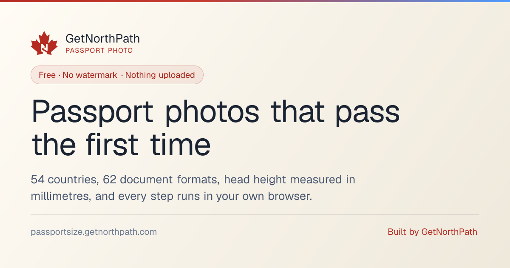
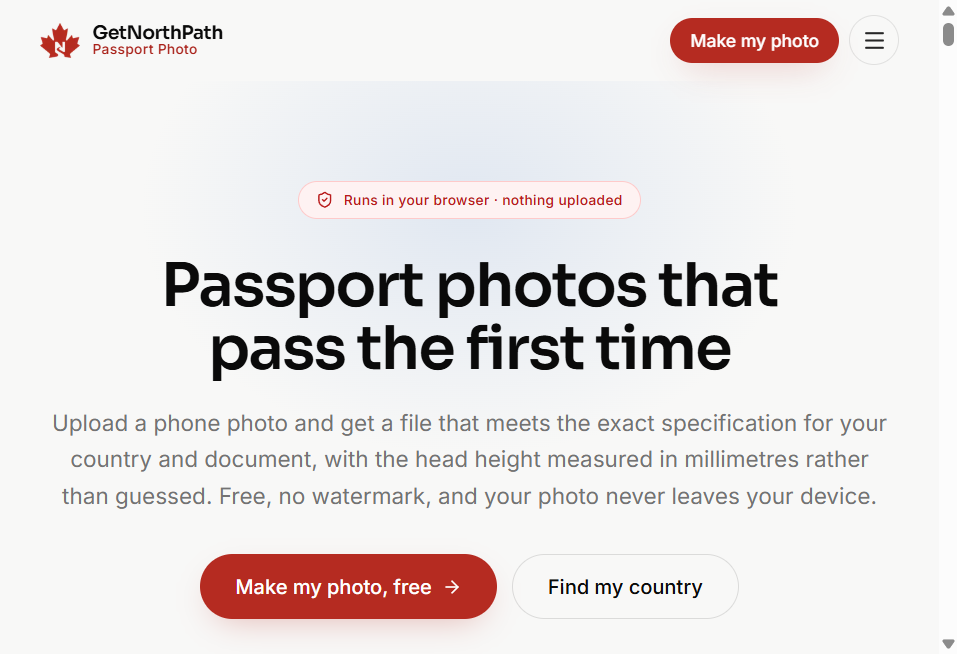

# GetNorthPath Passport Photo



> **Create a compliant passport, visa, or ID photo in your browser.**

**Free passport photo maker** from [GetNorthPath](https://www.getnorthpath.com). Country-accurate formats, millimetre head-height measurement, background replacement, and print-ready sheets. Your photo never leaves your device.

[](https://passportsize.getnorthpath.com/)
[](https://www.getnorthpath.com)
[](docs/RULES.md)
[](docs/pages/COUNTRIES.md)

This repository is the **public information hub** for the product: what Passport Size is, what the tools do, which countries and documents are supported, and how requirements are sourced. It is **not** the application source-code repository. The live product is at [passportsize.getnorthpath.com](https://passportsize.getnorthpath.com/).

---

## What we do

GetNorthPath Passport Photo (also branded **Passport Size** on the product subdomain) is a **free companion** for passport, visa, and ID photos: you pick a country and document, upload a front-facing photo in the browser, and download a print file or a digital upload that is closer to the published specification.

We do **not** replace passport offices, consulates, IRCC, the US Department of State, USCIS, or any other issuing authority. We **surface published photo rules** in tools and guides you can actually use. Official instructions always win.

Image processing runs **in your browser**. There is no image-upload endpoint. Face detection, background segmentation, cropping, and encoding stay on your device.

---

## Key features

| Feature | Description |
| --- | --- |
| **Passport photo maker** | Full editor with every supported country and document preset |
| **62 formats / 54 countries** | Passports, visas, citizenship, PR/residence cards, and immigration uploads |
| **Head height in millimetres** | Chin-to-crown (hair included), reported against the published range |
| **Background replacement** | White, off-white, light grey, cream, light blue, or transparent PNG |
| **Print and digital exports** | True DPI in the JPEG header; pixel and kilobyte presets for portals |
| **Print sheets** | Tile onto 4×6, 5×7, A4, or Letter with cut guides |
| **Six companion tools** | Background, crop, convert, resize in KB, compress image, signature resize |
| **Free to use** | No watermark, no account, no payment. Email unlocks the download |

### Live hub



[Make a photo](https://passportsize.getnorthpath.com/) · [Browse tools](https://passportsize.getnorthpath.com/tools) · [Find a country](https://passportsize.getnorthpath.com/passport-photo-by-country)

---

## How it works

```
1. Open the site                 →  No signup
2. Pick country and document     →  54 countries, 62 formats
3. Drop in a phone photo         →  Stays in this browser tab
4. Check millimetres and shade   →  Head height, background, compliance panel
5. Download print and/or digital →  Email unlocks the file; photo still never uploads
```

---

## Who it’s for

- Applicants who need a **passport, visa, or ID photo** that matches published millimetre and digital rules
- People preparing **IRCC, USCIS, DS-160, or similar** online uploads with pixel and kilobyte caps
- Anyone photographing **infants** who still need a plain background and a legal head-height crop
- Helpers who need a **shareable, cited** inventory of formats and official sources

> *Not affiliated with IRCC, the US Department of State, USCIS, or any passport authority. Tools are helpers. The issuing authority’s published specification and the reviewing officer prevail if anything disagrees.*
> See the in-app disclaimer and [terms of service](https://passportsize.getnorthpath.com/terms-of-service).

---

## Documentation in this repo

| Doc | What it covers |
| --- | --- |
| [docs/PAGES.md](docs/PAGES.md) | Live routes on passportsize.getnorthpath.com |
| [ABOUT.md](ABOUT.md) | What Passport Size is, and what this public repo is for |
| [docs/PRODUCT.md](docs/PRODUCT.md) | Product concept, users, journey, limits |
| [docs/FEATURES.md](docs/FEATURES.md) | Tools, documents, countries, sizes, guides |
| [docs/WORKFLOW.md](docs/WORKFLOW.md) | Select → upload → check → download/print |
| [docs/RULES.md](docs/RULES.md) | Country/document photo requirements |
| [docs/SOURCES.md](docs/SOURCES.md) | Official sources and review dates |
| [docs/PRIVACY.md](docs/PRIVACY.md) | Verified privacy and data-processing behaviour |
| [docs/FORMAT-MODEL.md](docs/FORMAT-MODEL.md) | Conceptual structure of a photo-format record |

Index: [docs/README.md](docs/README.md)

---

## Links

### Passport Size (this product)

- **Live app:** [passportsize.getnorthpath.com](https://passportsize.getnorthpath.com/)
- **Photo maker:** [tools/passport-photo-maker](https://passportsize.getnorthpath.com/tools/passport-photo-maker)
- **Countries:** [passport-photo-by-country](https://passportsize.getnorthpath.com/passport-photo-by-country)
- **Requirements:** [photo-requirements](https://passportsize.getnorthpath.com/photo-requirements)
- **FAQ:** [faq](https://passportsize.getnorthpath.com/faq)
- **How it works:** [how-it-works](https://passportsize.getnorthpath.com/how-it-works)
- **Formats dataset:** [JSON](https://passportsize.getnorthpath.com/data/passport-photo-formats.json) · [CSV](https://passportsize.getnorthpath.com/data/passport-photo-formats.csv)
- **Machine index:** [llms.txt](https://passportsize.getnorthpath.com/llms.txt)

### Official sources (always win)

- **Canada passport photos:** [canada.ca](https://www.canada.ca/en/immigration-refugees-citizenship/services/canadian-passports/photos.html)
- **IRCC photo specifications:** [canada.ca PR photos](https://www.canada.ca/en/immigration-refugees-citizenship/services/permanent-residents/card/photos.html)
- **US State Department photos:** [travel.state.gov](https://travel.state.gov/content/travel/en/passports/how-apply/photos.html)
- **GOV.UK passport photos:** [gov.uk](https://www.gov.uk/photos-for-passports)

### GetNorthPath (parent)

- **Website:** [getnorthpath.com](https://www.getnorthpath.com)
- **Free DIY tools:** [getnorthpath.com/tools](https://www.getnorthpath.com/tools)
- **IRCC Ready Docs:** [docs.getnorthpath.com](https://docs.getnorthpath.com)
- **OINP Calculator:** [oinp.getnorthpath.com](https://oinp.getnorthpath.com)
- **AORTrack:** [track.getnorthpath.com](https://track.getnorthpath.com)
- **Contact / walkthrough:** [getnorthpath.com/contact](https://www.getnorthpath.com/contact)
- **GitHub org:** [github.com/Get-North-Path](https://github.com/Get-North-Path)

### Legal

- **Privacy (this product):** [privacy-policy](https://passportsize.getnorthpath.com/privacy-policy)
- **Terms (this product):** [terms-of-service](https://passportsize.getnorthpath.com/terms-of-service)
- **Parent privacy / terms / cookies:** [privacy](https://www.getnorthpath.com/privacy) · [terms](https://www.getnorthpath.com/terms) · [cookies](https://www.getnorthpath.com/cookies)

---

## License

Documentation in this repository is available under the **MIT License**.

The public formats dataset on the live site is published under **[CC BY 4.0](https://creativecommons.org/licenses/by/4.0/)**. Attribution: GetNorthPath Passport Photo.

© GetNorthPath Inc. GetNorthPath Passport Photo is free to use. Not affiliated with IRCC, the US Department of State, USCIS, or any passport authority. Tools are **helpers**, not official government software or legal advice.

---

**The photo should not be a paywall.**
