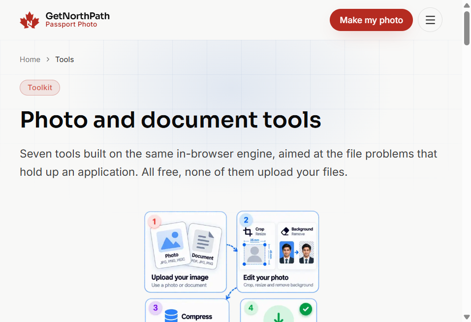

# Tools

**Live:** [https://passportsize.getnorthpath.com/tools](https://passportsize.getnorthpath.com/tools)

**Nav:** Free tools

Each tool is its own free page. Processing is described as in-browser. Application photos, scans, and signatures are not uploaded for those operations.

### Tools we provide

| Toolkit |
| :---: |
|  |

---

## Live tools on this site

| Tool | URL | What it does |
| --- | --- | --- |
| Passport photo maker | […/tools/passport-photo-maker](https://passportsize.getnorthpath.com/tools/passport-photo-maker) | 62 formats; millimetre head height; print/digital |
| Background remover | […/tools/background-remover](https://passportsize.getnorthpath.com/tools/background-remover) | Compliant shades or transparent PNG |
| Crop to passport size | […/tools/crop-photo-to-passport-size](https://passportsize.getnorthpath.com/tools/crop-photo-to-passport-size) | Calculated crop from chin and crown |
| Resize photo in KB | […/tools/resize-photo-in-kb](https://passportsize.getnorthpath.com/tools/resize-photo-in-kb) | Quality search to a KB ceiling (US 240 KB preset highlighted) |
| Compress image | […/tools/compress-image](https://passportsize.getnorthpath.com/tools/compress-image) | Shrink scans toward IRCC-style megabyte caps |
| Signature resize | […/tools/signature-resize](https://passportsize.getnorthpath.com/tools/signature-resize) | Ink threshold; India 140×60 under 20 KB and other presets |
| Convert photo to passport size | […/tools/convert-photo-to-passport-size](https://passportsize.getnorthpath.com/tools/convert-photo-to-passport-size) | Frame, head scale, background, DPI, file size |

The tools hub copy: these seven exist because applications stall on crop, wall colour, kilobyte limits, and signature boxes.

---

## Shared editor notes (photo maker family)

- Upload: JPG, PNG, WEBP up to 25 MB; HEIC on most modern browsers
- Compliance panel in real time after upload
- Optional email unlock; no watermark
- Feedback form: written note, not a photo attachment

---

## Related

- Sequences: [WORKFLOW.md](../WORKFLOW.md)
- Requirements: [RULES.md](../RULES.md)
- Inventory: [FEATURES.md](../FEATURES.md)

**Official source:** always the issuing authority for the document you selected. Index: [SOURCES.md](../SOURCES.md)
